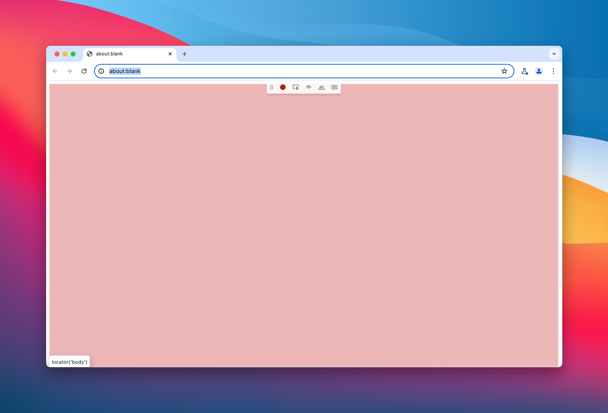
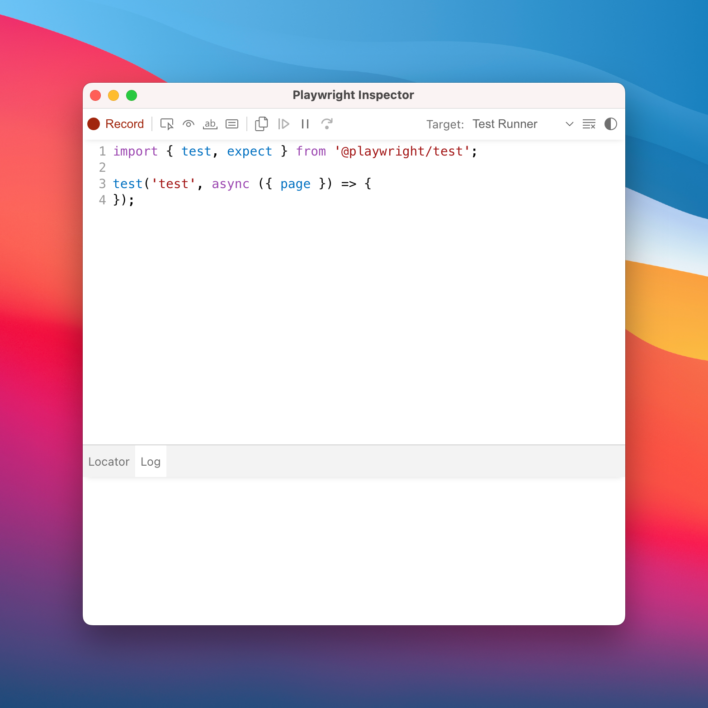
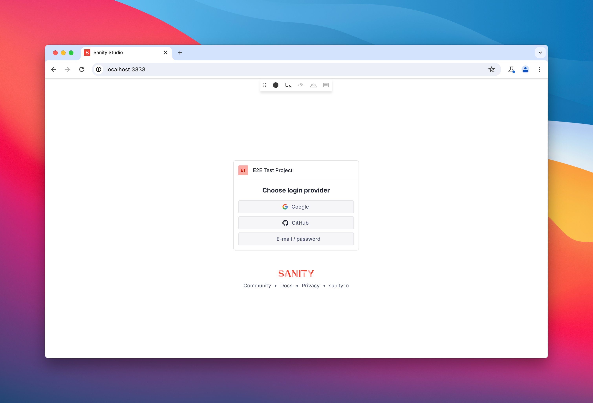
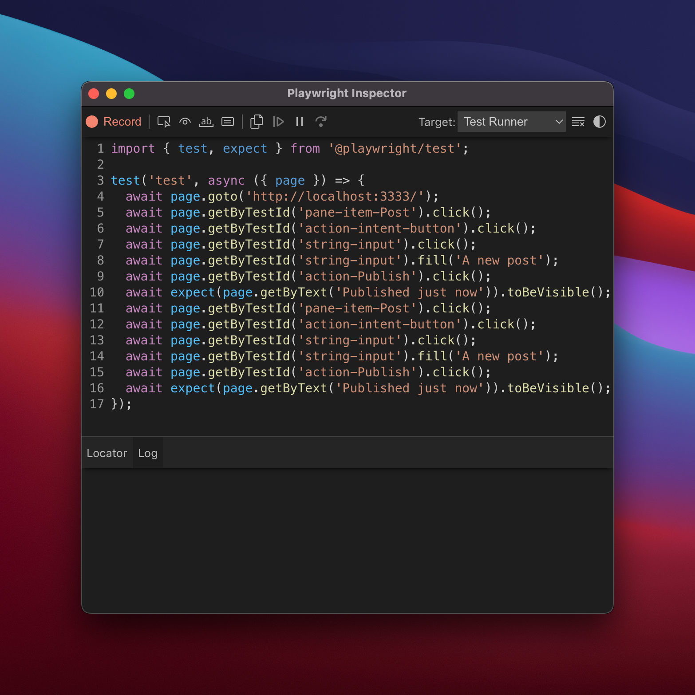

## Introduction

At my full time job at WebriQ, we've come to a point that we had to automate things. One of my personal goals and focus this year is to improve our processes in developing and releasing [Stackshift](https://www.webriq.com/stackshift).

To give you a little bit of context, Stackshift is composed of a significant number of **components** ranging from `header`, `hero`, `cta`, `features`, all the way to `footer` and each of these components have **variants** in them, `Variant A`, `Variant B`, `Variant C`, `Variant D`, 4 on average each representing a unique yet proven design that works for modern sites today.

Normally, we wouldn't need to set this up but seeing how much time and effort we take to repeatedly do the manual work, we thought it's about time to invest on automating this process.

This post will show you how to set up [Playwright](https://playwright.dev/) in your Sanity project in order to perform end-to-end testing.

## You might ask, what do I need this for?

Normally, you wouldn't need this. You'll know when you do and when the time comes, I hope this guide will help you.

As an example, you built a tool which does a couple of things. You can use Playwright to automate the testing as like how a real user would use it.

## Pre-requisites

A Sanity Studio project run locally. That's all! 👏..

If you haven't, [get started by signing up for an account](https://www.sanity.io/get-started) then creating your first Studio.

## Installing Playwright and dependencies

First, we need to install Playwright. Depending on your prefered package installer, you might need to make adjustments.

```bash
npm init playwright@latest
```

Upon bootstrapping, you'll be asked with the following questions. Just proceed with the defaults.

```bash
Initializing project in '.'
✔︎ Where to put your end-to-end tests? ⋅ tests
✔︎ Add a GitHub Actions workflow? (y/N) ⋅ false
✔︎ Install Playwright Test (yarn add --dev @playwright/test)
```

This will go through installing dependencies and downloading browsers for the first setup. Once done, you'll be greated with a `✔︎ Success` and have the commands available for you.

```sh
yarn playwright test
```

## Writing our first test

Playwright comes with a code generator which allows us to easily write test as it records our actions as we perform our tests. This is a great way to get started as we can easily relate to it.

To begin with, let's generate our first test with:

```sh
npx playwright codegen
```

After running the command, a browser will launch.



as well as another inspector browser where code is generated after performing some actions.



Let's write a test to verify that we can create a blog post.

1. In the Chromium browser as per above, let's navigate to `http://localhost:3333`.
2. At this point, we'll need to authenticate. For now, just authenticate with the account type you used to sign up. Later on, we'll do authentication setup separately.
   
3. After logging in, we can then start recording and do our usual thing like here in my case, it's creating a new post.
   
   and just like that, it'll output the code we need.
   
4. Create a new file named `sample.spec.ts` or if you're using JavaScript, then you can just use the `.js` extension and paste that in!
5. Voila. You just wrote your first test. Well done! 👏

## Authentication with Sanity Studio

At this point, when you run the test, it'll not succeed because Playwright can't authenticate by itself. We need to find a way to authenticate. The best way I could find for now is to [use this approach - Basic: shared account in all tests](https://playwright.dev/docs/auth#basic-shared-account-in-all-tests).

All we gotta do is do a one time set up and we can reuse our authenticated session later on. If need be, we can re-authenticate when Sanity auth expires.

Let's get into it:

1. Create `tests/auth.setup.ts` that will prepare authenticated browser state for all other tests.
2. Copy the code below:

```js
import { test as setup, expect } from '@playwright/test'

const authFile = 'playwright/.auth/user.json'

setup('authenticate', async ({ page }) => {
	// Update your `.env.development` to make sure this are not empty
	const username = process.env.SANITY_STUDIO_ACCOUNT_USERNAME
	const password = process.env.SANITY_STUDIO_ACCOUNT_PASSWORD

	if (!username || !password) {
		throw new Error('Verify username and password is properly set!')
	}

	// Perform authentication steps. Replace these actions with your own.
	await page.goto('http://localhost:3333/')
	await page.getByRole('link', { name: 'E-mail / password' }).click()
	await page.getByPlaceholder('jane@example.com').click()
	await page.getByPlaceholder('jane@example.com').fill(username)
	await page.getByPlaceholder('jane@example.com').press('Tab')
	await page.getByLabel('Password').fill(password)
	await page.getByRole('button', { name: 'Sign in' }).click()

	// Wait until the page receives the cookies.
	//
	// Sometimes login flow sets cookies in the process of several redirects.
	// Wait for the final URL to ensure that the cookies are actually set.
	await page.waitForURL('http://localhost:3333/')

	// Alternatively, you can wait until the page reaches a state where all cookies are set.
	await expect(page.getByTestId('new-document-button')).toBeVisible()

	// End of authentication steps.

	await page.context().storageState({ path: authFile })
})
```

3. Create a `.env.development` in your root project and add in the following variables, make sure to update the values accordingly.

```sh
SANITY_STUDIO_ACCOUNT_USERNAME=me+playwrightesting@dorelljames.com
SANITY_STUDIO_ACCOUNT_PASSWORD=MyTestPassword
```

4. In our `playwright.config.ts`, we need to add it as dependency telling Playwright that all tests need to perform the above so we can expect that every `page` is authenticated thereafter and our tests will now passed.

```js
// playwright.config.ts
import { defineConfig, devices } from '@playwright/test';
import dotenv from 'dotenv' // 👈 Use ES6 syntax instead of `require('dotenv').config()

/**
 * Read environment variables from file.
 * https://github.com/motdotla/dotenv
 */
dotenv.config() // 👈 Replaced `require('dotenv').config();` with ES6 so our `.env.development` variable will be read.

export default defineConfig({
  projects: [
    // Setup project
    { name: 'setup', testMatch: /.*\.setup\.ts/ }, // 👈  Adding this matcher

    {
      name: 'chromium',
      use: {
        ...devices['Desktop Chrome'],
        // Use prepared auth state.
        storageState: 'playwright/.auth/user.json', // 👈  Adding this auth file storage
      },
      dependencies: ['setup'], // 👈  Adding this to tell the above setup is needed before this
    },

```

5. Lastly, create a file `playwright/.auth/user.json` and put an `{}` inside as its content.

## Running Our Test

Re-run the test and it should authenticate by now. Your `playwright/.auth/user.json` should have values now - cookie information and other related data on the current browser session.

And that's it folks. Thank you! Let me know if it works for you.
