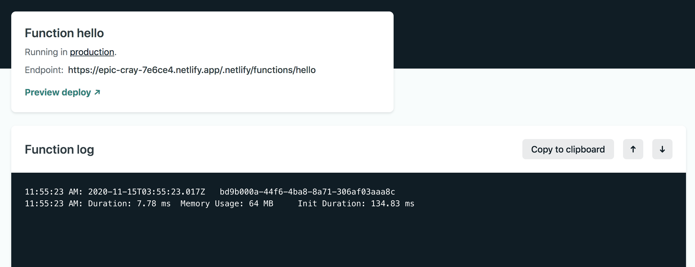
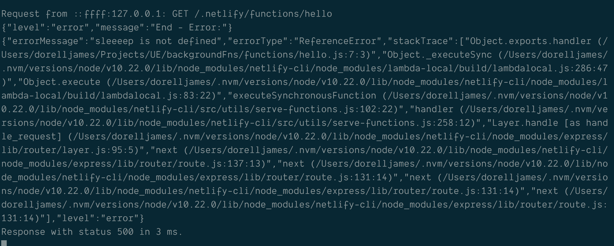
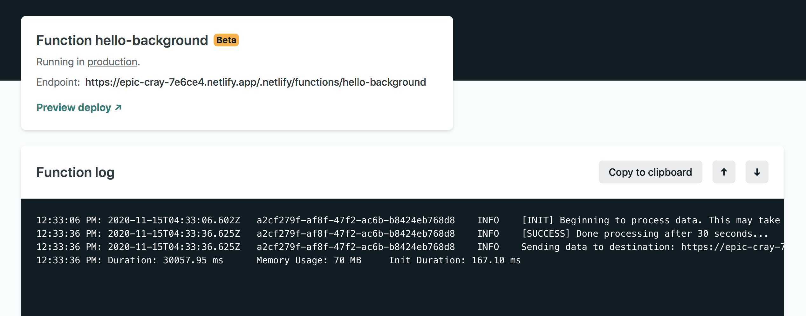
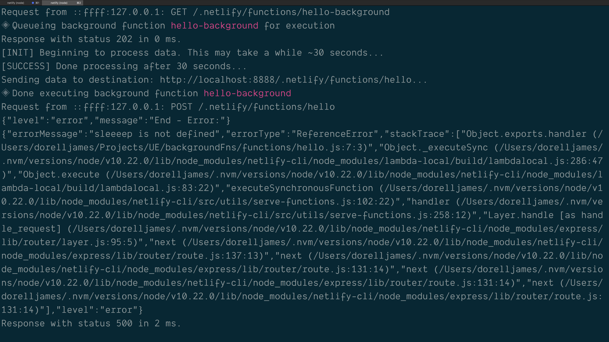

The [announcement of the availability of Background Functions](https://www.netlify.com/blog/2020/10/29/announcing-background-functions/) got me so excited that I immediately hopped into it. I even talked about this in an online stream we did last Nov 14 at **Uncaught Exceptions**. You can [watch that here](https://youtu.be/HYA-SYZWYWU?t=55) if you're interested! 😊

## Short Demo

<div style="position: relative; padding-bottom: 55.04587155963303%; height: 0;"><iframe src="https://www.loom.com/embed/2e855fffef5f4728a170227f9d804650" frameborder="0" webkitallowfullscreen mozallowfullscreen allowfullscreen style="position: absolute; top: 0; left: 0; width: 100%; height: 100%;"></iframe></div>

## Quick Intro

Serverless functions open a world of possibilities for running on-demand, server-side code without having to run a dedicated server. AWS's serverless Lambda functions are great but it also comes with its own set of complexity, eg: managing service discovery, configuring API gateways, and many more which can become overwhelming especially if you're just new to this.

[Netlify Functions](https://docs.netlify.com/functions/overview/) is nothing but **AWS Lambda's without the complexity**. They are by deployed with following generous defaults below:

- us-east-1 AWS Lambda region
- 1024MB of memory
- 10 second execution limit for synchronous serverless functions
- **15 minute execution limit for background functions** `NEW`

So basically with the recent addition of **Netlify Background Functions** you can do more things rather than trying to cram it up under 10 seconds.

## Fundamental Difference

With Background Functions, you'll immediately get a response with status code of **202** and the process is queued in the background, and it's up to you how you deal with the data and errors while the normal functions are pretty much like API's which you interface using HTTP methods and their responses can be customized according to your needs ranging from 100 to 500. The only major difference is that in background functions, you have a whooping 15 minutes before it timeouts while it timeouts after 10 seconds in default for non-background function.

| Desc                 | Normal Functions                         | Background Functions                       |
| -------------------- | ---------------------------------------- | ------------------------------------------ |
| Status Code          | 100 - 500 (custom)                       | 202                                        |
| Execution Feedback   | After completion either success or error | Immediate response (catch errors yourself) |
| Execution Type       | Synchronous                              | Asynchronous                               |
| Execution Time       | up to 10 seconds                         | up to 15 minutes                           |
| Response Destination | Client (eg: Browser)                     | Sent to a destination                      |

## Getting started

The process for creating and deploying Netlify Functions vs Netlify Background Functions is nearly the same. The key difference is adding `-background` to the end of your function name.

So, for example, if you name a function

```js
hello.js;
```

It will deploy as a synchronous function that returns its response to the client (eg: browser) after the function completes. Because the client is waiting on a response, the function must finish within 10 seconds, or it will fail as it timeouts.

However, if you change the name to

```
hello-background.js
```

It will deploy as a background function that returns an immediate client response on successful invocation, then continues running in the background until it completes asynchronously — up to 15 minutes later. Background Functions are a sub-type of Netlify Functions.

NOTE: It is important that you setup Netlify to [recognize the functions directory](https://docs.netlify.com/functions/configure-and-deploy/#configure-the-functions-folder).

## Pricing

Netlify Functions, including Background Functions, are priced per site based on the number of invocations and the total runtime. Level 0 Functions come with 125K requests and up to 100 hours per month. Check pricing for Functions add-ons.

## How It Works

Consider the following examples below:

### Netlify Functions (Normal)

```js
// hello.js

exports.handler = async (event, context) => {
  return {
    statusCode: 200,
    body: JSON.stringify({
      message: "Serverless Functions are cool! 😎",
    }),
  };
};
```

As soon as you invoke the function, we expect that it should return a response after 10 seconds. This operation is synchronous.

#### Sample Responses

#### Success operation as seen in local dev server using [Netlify Dev](https://cli.netlify.com/commands/dev)


#### Success operation as seen in Functions Log at [Netlify App](app.netlify.com)



#### Unsuccessful operation as function timeouts as it hits limit of 10 seconds


#### Unsuccessful operation as function encounters an error (syntax as per this example)



---

### Netlify Background Functions

```js
// hello-background.js

const fetch = require("node-fetch");

exports.handler = async (event, context) => {
  const destination = `http://localhost:8888/.netlify/functions/hello`;
  const timeout = 15; // seconds
  const sleep = (seconds) =>
    Promise.resolve(() => setTimeout(resolve, +seconds * 1000));

  // Simulating fake long running sequence
  console.log(
    `[INIT] Beginning to process data. This may take a while ~${timeout} seconds...`
  );
  await sleep(timeout); // seconds
  console.log(`[SUCCESS] Done processing after ${timeout} seconds...`);
  console.log(`Sending data to destination: ${destination}...`);

  // Sending data to a destination
  fetch(destination, {
    method: "POST",
    body: JSON.stringify({
      message: `Successfully processed request with ID: ${
        Math.random() * 1000
      }`,
      date: new Date().toGMTString(),
    }),
  });
};
```

As soon as the function is invoked, a 202 response is received and the process is queued in the background. After sleeping for 15 seconds, it sends a POST request to `hello` function but your usage could vary. It is really up to you what you should do about it.

#### Success operation as seen in local dev server using [Netlify Dev](https://cli.netlify.com/commands/dev) for background function


#### Success operation as seen in Functions Log at [Netlify App](app.netlify.com) for background function



#### Unsuccessful operation as function encounters an error (syntax as per this example) for background function



## Frequently Asked Questions (FAQ)

### What happens after the 202 response in background functions?

A: It is up to you! For example, if you're processing thousands of document data, then you can probably send the result summary in an email, forward the raw response to a webhook and many more.

### Can you only build functions in JavaScript?

A: No, aside from JavaScript which runs in a node environemnt, version 12 of the time of this writing, you can also [build them using Go](https://docs.netlify.com/functions/build-with-go/).

### What happens if my background function fails?

A: In production, if function execution returns an error, AWS will retry the execution after one minute. If it fails again, another retry happens two minutes later. When a background function is successfully executed, you generally pass the result to a destination other than the originating client.

### Can I do custom deployments such as different AWS region, adjust memory limits?

A: Yes, you can contact sales at Netlify.

### How do you catch errors in background functions?

A: If you're using JavaScript, you can utilize `try / catch`, see below:

```
try {
  // everything you do is here
} catch(err) {
  // do something when an error occurs here
}
```

## References

- Code Examples: https://functions.netlify.com/examples
- Tutorials: https://functions.netlify.com/tutorials
- Community Forum: https://community.netlify.com/categories
- Background Function Announcement: https://www.netlify.com/blog/2020/10/29/announcing-background-functions/
- Technical Documentation: https://docs.netlify.com/functions/background-functions/
